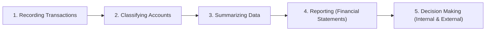
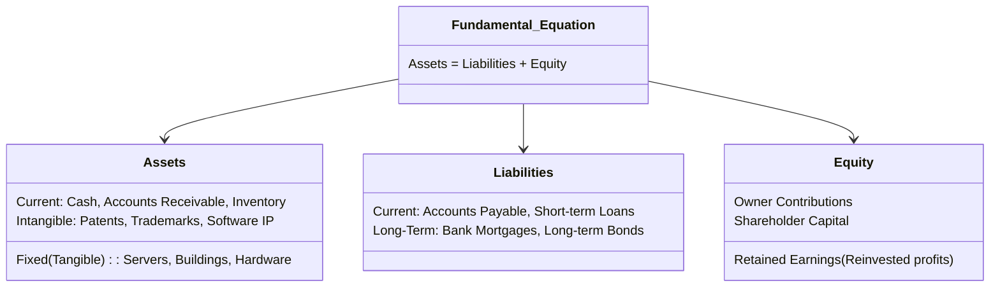
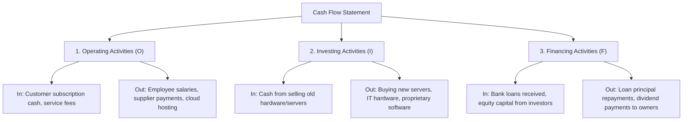

<div align="center">

# IT3120 — Financial Accounting for Decision Makers
## Lecture 5: Introduction to Financial Accounting

</div>

> **Core Focus:** Balance Sheet, Profit and Loss (Income Statement), Cash Flows, and Financial Ratio Analysis.

---

## 🎯 Lecture Objectives

- Understand the purpose of **financial accounting** and its role in business decision-making.
- Explain the structure and key components of the **Balance Sheet**, **Profit & Loss (Income) Statement**, and **Cash Flow Statement**.
- Interpret financial statements to assess a company's **financial performance**, **position**, and **liquidity**.
- Calculate and analyze basic **financial ratios** to evaluate overall business health.
- Apply accounting concepts to real-world **IT scenarios** and project investment decisions.

---

## 1. What is Financial Accounting?

**Financial Accounting** is the structured process of:
1. **Recording** financial transactions
2. **Classifying** them into appropriate accounts (Assets, Liabilities, Equity, Revenue, Expenses)
3. **Summarizing** transactions into standardized statements
4. **Reporting** the results to provide meaningful information for decision-making.



### Key Purposes & Target Audience
- **External Users:** Prepares financial reports (Balance Sheet, Income Statement, Cash Flow Statement) primarily for external stakeholders such as investors, lenders/banks, suppliers, and regulatory bodies to evaluate stability, risk, and viability.
- **Internal Decision-Making:** Helps IT managers evaluate capital expenditure (e.g., cloud vs. on-premise hardware, hiring engineering contractors, software development project viability, and budget management).

---

## 2. Core Accounting Terminology

### 💵 Revenue vs. Income
- **Revenue ("Top Line"):** The total gross amount of money earned by the business from selling software, IT services, subscriptions, or hardware before deducting any expenses.
- **Income ("Bottom Line" / Profit):** The net remaining money after subtracting all costs, operational expenses, interest, and taxes from total revenue.

### 💳 Expenses vs. Expenditure
- **Expenses:** Recurring operational costs incurred to run day-to-day business operations (e.g., engineer salaries, monthly AWS/Azure hosting bills, office rent, internet connectivity).
- **Expenditure:** Any outflow of money. Not all expenditures are immediate operational expenses—for instance, purchasing server racks or specialized workstations is a **capital expenditure (CapEx)** / asset investment rather than an everyday expense.

### 📈 Profit vs. Loss
$$\text{Revenue} - \text{Expenses} = \text{Profit (if } > 0\text{) or Loss (if } < 0\text{)}$$
- **Profit:** Revenue exceeds total expenses. The business is generating surplus capital.
- **Loss:** Expenses exceed revenue. The business is operating in the red.

### 💰 Cash Flow (Positive vs. Negative)
- **Positive Cash Flow:** More liquid money enters the business than exits during the period. The company can pay upcoming obligations, invest, and grow.
- **Negative Cash Flow:** More money leaves the business than comes in.
  > ⚠️ **Important Insight:** A company can be profitable on paper (accrual accounting) yet still run out of liquid cash and go **bankrupt** if customer payments are delayed while debts and payroll fall due.

---

## 3. The Fundamental Accounting Elements



### A. Assets
Resources owned or controlled by the business that bring future economic benefits:
1. **Current Assets:** Easily convertible to cash within **1 year** (e.g., cash on hand, bank deposits, accounts receivable, short-term subscriptions).
2. **Fixed / Non-Current Assets:** Long-term physical assets used over multiple years (e.g., servers, computers, office buildings, networking equipment).
3. **Intangible Assets:** Non-physical assets with monetary value (e.g., patents on algorithms, trademarks, software licenses, goodwill).

### B. Liabilities
Financial debts and obligations owed by the business to third parties:
1. **Current Liabilities:** Debts and obligations due within **1 year** (e.g., unpaid cloud vendor invoices/accounts payable, credit card balances, short-term loans).
2. **Long-Term Liabilities:** Financial obligations due beyond **1 year** (e.g., 5-year bank development loans, office mortgages).

### C. Equity (Owner's Worth)
Equity represents the residual interest in the business assets after deducting all liabilities:
$$\text{Equity} = \text{Assets} - \text{Liabilities}$$

**Components of Equity:**
- **Owner's Capital / Contributions:** Initial and subsequent capital invested by founders.
- **Retained Earnings:** Cumulative net profits kept in the business and reinvested over time.
- **Shareholder Value:** Share capital held by investors.

---

## 4. The Three Key Financial Statements

| Statement | Time Horizon | Key Question Answered | Core Elements |
| :--- | :--- | :--- | :--- |
| **Balance Sheet** | Snapshot at a **specific date** (Point in Time) | *What is the company's financial position, liquidity, and capital structure?* | Assets, Liabilities, Equity |
| **Income Statement (P&L)** | Performance over a **period of time** (e.g., Year/Quarter) | *Is the company operating profitably or making a loss?* | Revenue, Cost of Sales, Operating Expenses, Net Profit |
| **Cash Flow Statement** | Cash movement over a **period of time** | *Where is cash coming from and where is it being spent?* | Operating, Investing, and Financing Cash Flows |

---

## 5. Income Statement Profit Levels

The Income Statement breaks profit down into distinct tiers to isolate operational efficiency from tax and financing effects:

```
Total Sales Revenue (Top Line)
   − Cost of Sales (COGS / Direct Production & Hosting Costs)
═════════════════════════════════════════════════════════════
= GROSS PROFIT (Measures core production efficiency)
   − Operating Expenses (Salaries, Marketing, Rent, Administration)
═════════════════════════════════════════════════════════════
= OPERATING PROFIT / EBIT (Measures core operational strength)
   − Finance Costs (Interest on debt)
   − Income Tax Expenses
═════════════════════════════════════════════════════════════
= NET PROFIT (Bottom Line / Residual earnings for shareholders)
```

---

## 6. The Three Cash Flow Activities



$$\text{Net Cash Flow} = \text{Operating Cash Flow} + \text{Investing Cash Flow} + \text{Financing Cash Flow}$$

---

## 7. Financial Ratio Analysis

Financial ratios establish relationships between key numbers across the Balance Sheet and Income Statement to assess health and efficiency:

### 1. Profitability Ratios
- **Gross Profit Margin:**
  $$\text{Gross Profit Margin} = \left(\frac{\text{Gross Profit}}{\text{Revenue}}\right) \times 100$$
- **Net Profit Margin:**
  $$\text{Net Profit Margin} = \left(\frac{\text{Net Profit}}{\text{Revenue}}\right) \times 100$$

### 2. Liquidity Ratios
- **Current Ratio:**
  $$\text{Current Ratio} = \frac{\text{Current Assets}}{\text{Current Liabilities}}$$
  *Evaluation:* A ratio of **2:1 (2.0)** or higher represents healthy short-term solvency.

### 3. Efficiency Ratios
- **Receivables Collection:** How quickly clients settle invoices (e.g., telecom prepaid model produces rapid cash conversion).
- **Payables Period:** The duration taken by the business to settle invoices with suppliers.

### 4. Gearing (Leverage) Ratios
- **Debt-to-Equity Ratio:**
  $$\text{Debt-to-Equity Ratio} = \frac{\text{Total Debt / Borrowings}}{\text{Total Shareholders' Equity}}$$
  *Evaluation:* Indicates financial risk and capital structure. Higher gearing means greater debt reliance, requiring steady operating cash flows to service interest.

---

## 8. Real-World Case Study: Dialog Axiata PLC

Dialog Axiata PLC is Sri Lanka's leading telecommunications and digital services conglomerate.

### Summary Financial Statements (LKR Billion)

#### 1. Income Statement
| Item | Amount (LKR Billion) |
| :--- | :--- |
| **Revenue** | 180 |
| Cost of Sales | (90) |
| **Gross Profit** | **90** |
| Operating Expenses | (50) |
| **Operating Profit** | **40** |
| **Net Profit** | **20** |

#### 2. Balance Sheet
| Item | Amount (LKR Billion) |
| :--- | :--- |
| **Total Assets** | 286 |
| **Total Liabilities (Debt)** | 220 |
| **Shareholders' Equity** | 66 |

#### 3. Cash Flow Statement
| Activity | Amount (LKR Billion) |
| :--- | :--- |
| Operating Cash Flow | +49 |
| Investing Activities (CapEx in network/towers) | (20) |
| Financing Activities (Debt servicing & dividends) | (10) |
| **Net Cash Flow** | **+19** |

---

### Key Financial Ratios & Industry Insights

```
┌─────────────────────────┬──────────────┬────────────────────────────────────────────────────────┐
│ Metric                  │ Value        │ Strategic IT / Telecom Insight                         │
├─────────────────────────┼──────────────┼────────────────────────────────────────────────────────┤
│ Gross Profit Margin     │ 50%          │ Strong margins from digital and voice services         │
│ Net Profit Margin       │ 11%          │ Healthy bottom line after all costs and depreciation   │
│ Current Ratio           │ 2:1          │ Strong liquidity; can easily meet short-term debts     │
│ Receivables Collection  │ Fast         │ Driven by prepaid customer recharge model              │
│ Debt-to-Equity Ratio    │ 2.3:1 (High) │ Heavy infrastructure borrowing for 4G/5G rollout       │
└─────────────────────────┴──────────────┴────────────────────────────────────────────────────────┘
```

### Strategic Conclusion:
1. **Strong Profitability:** Solid margin generation from telecom network scale.
2. **Positive Cash Generation:** Operating cash flow (+49B) easily covers heavy capital investment (−20B) and debt repayment (−10B).
3. **High but Manageable Gearing (2.3:1):** Telecommunication networks require massive upfront capital expenditures (fiber, towers, spectrum licenses). Because cash flow is steady and recurring, this high leverage supports aggressive growth without imperiling solvency.

---

## ⬆️ [Back to Financial Accounting Index](../README.md)
