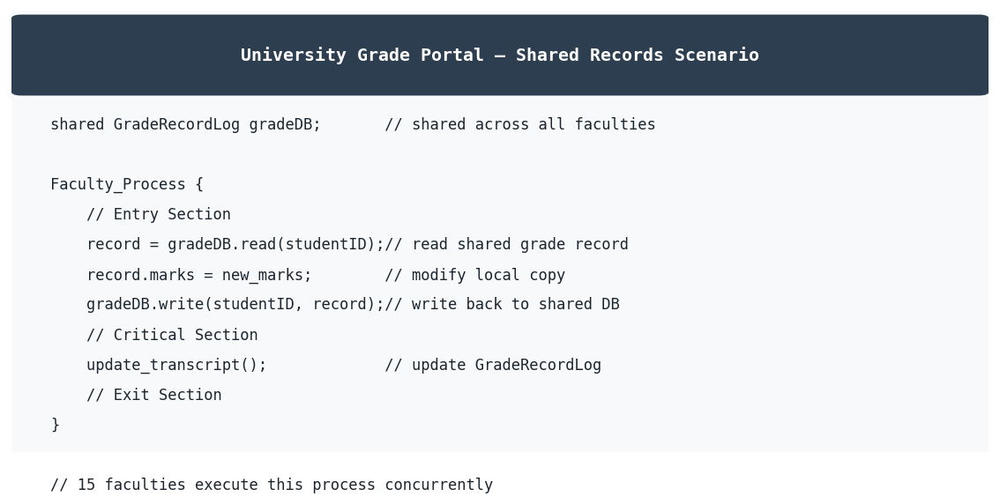
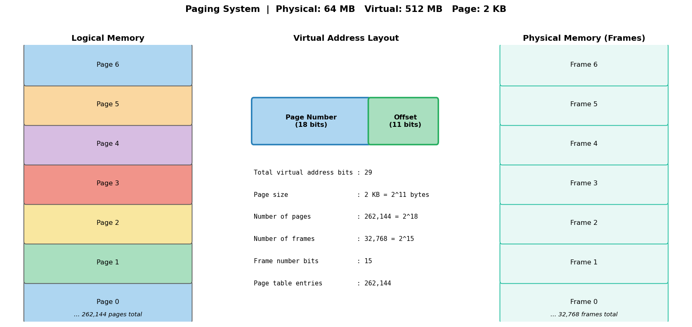
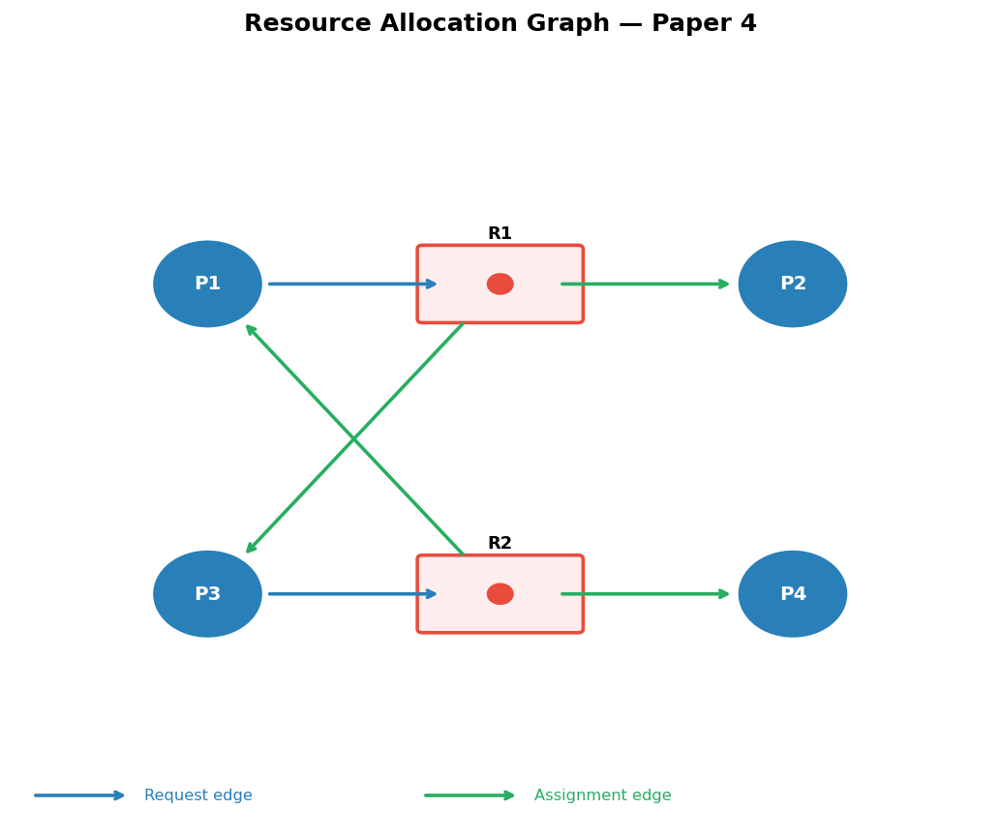

# IT2130 Operating Systems and System Administration Year 2, Semester 2

# Final Examination

## Question 1

a. Briefly explain the following terms in relation to the process synchronization:

i. Critical Section

ii. Busy Waiting

b. List the three requirements that must be satisfied by solution to critical section problem.

c. List the names of two atomic instructions.

d. Consider the system which manages student grades for a university with 15 faculties and more than 5000 students. Each faculty updates student grades through a shared portal. Each grade update will be stored in a shared file named GradeRecordLog.

i. Find the critical section of the above grade management system.

ii. Design a solution for the above critical section problem.

## Question 2

a. Briefly explain the following terms in relation to the memory management:

i. Paging

ii. Internal Fragmentation

b. Consider the following contiguous memory allocation system with the free memory segments of A, B, C, D with the size of 100KB, 300KB, 450KB and 150KB respectively.

i. List the main two problems in contiguous memory allocation.

ii. If a new process has introduced into the system with the size of 250KB, briefly explain how does the operating system allocates the memory

1. if the compaction is used

2. if the paging is used

Note: You can make any assumption in designing the paging solution

iii. Which solution (compaction or paging) is used by the modern operating systems?

iv. Why does a system need a page table in paging system?

c. A computer system has 64MB physical memory and 512MB virtual memory, if the operating system uses 2KB page in paging system.

i. Find the number of pages of the system.

ii. Find the number of frames of the system.

iii. How many bits are allocated to the page number, frame number and offset?

iv. How many entries are there in the page table?

## Question 3

a. List the four necessary conditions to have a deadlock in a system.

b. Propose two solutions to prevent the deadlock by deny the hold and wait condition.

c. How does the modern general purpose operating system solve the deadlock problem?

d. Consider the following resource allocation graph for a system

i. Why do we draw the resource allocation graph?

ii. Does the system is in a deadlock situation? Justify your answer.

e. Consider the following snapshot of a system:

<table border="1"><tr><td>Process</td><td>Allocation</td><td>Maximum Needs</td><td>Available</td></tr><tr><td>P</td><td>3</td><td>6</td><td>2</td></tr><tr><td>Q</td><td>1</td><td>5</td><td></td></tr><tr><td>R</td><td>4</td><td>8</td><td></td></tr><tr><td>S</td><td>2</td><td>4</td><td></td></tr></table>

Answer the following questions using the banker's algorithm:

i. What is the content of the matrix Need?

ii. Is the system in a safe state?

iii. If a request from process R arrives for 1 resource, can the request be granted immediately?

## Question 4

a. Briefly explain the following terms in relation to the virtual memory management:

i. Demand Paging

ii. Valid / Invalid bit

b. List all steps that must be taken by the operating system when there is a page fault.

c. Compare and contrast the virtual address and physical address.

d. List the two hardware resources needed for the implementation of virtual memory system.

e. Consider the following page reference string: 1, 2, 3, 4, 1, 2, 5, 1, 2, 3, 4, 5

How many page faults would occur for the following replacement algorithms, assuming four, five frames? Remember all frames are initially empty, so your first unique pages will all cost one fault each.

i. LRU replacement

ii. FIFO replacement
